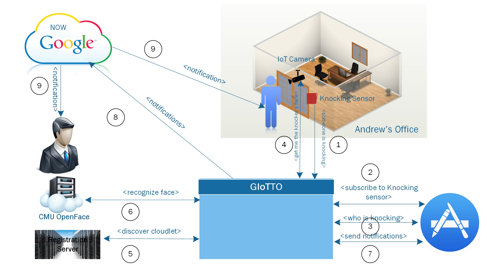

# Leveraging Edge-Analytics in IoT

*Knocking demo using the Giotto Stack.*

---
This is an open source application built on top of the GIoTTO stack to showcase how an IoT app can leverage the stack functionality to offer advanced features and complex interactions between multiple IoT entities. It also demonstrates how Edge Analytics reduces the end-to-end time required for IoT scenarios. The schematic diagram of the application is shown in Figure 1. 



# Required Devices
+ [TI sensor tag] (http://www.ti.com/tool/cc2541dk-sensor)
+ [Raspberry PI] (https://www.raspberrypi.org/blog/raspberry-pi-3-on-sale/)
+ IP camera
+ Internet connection

# How does it work?
The [knocking.conf] (./knocking.conf) file holds the configurations required for the demo:
+ camera_ip, the IoT camera IP in IPv4 format 0.0.0.0
+ BD_domain, url for buildingdepot
+ base_url, service url @ buildingdepot
+ res, checing resosultion, how frequent to check on the sensor data
+ knockingSensor_uuid, where knocking sensor posts time-series data
+ postSensor_uuid, where google cards information are posted

# GIoTTO stack installation
The entire GIoTTO stack can be installed [here](http://cmu.buildingdepot.org/BuildingDepot.tar.gz). For full description, installation guide and API documentation, please refer to the BuildingDepot [webpage] (http://buildingdepot.andrew.cmu.edu/). Once installation is complete, you need to register with the platform and create a username and password. Use the registration credentials to login to the system and create 2 snesor IDs: knockingSensor_uuid to store the knocking sensor times series data and postSensor_uuid to post the Google Now card information. Copy the generated uuids of both sensors to respective lines in the [knocking.conf] (./knocking.conf).

# Setting up the knocking virtual sensor
The TI sensor tag is used to detect the knocking signal. The current version of the TI sensor tag can communicate only through BLE. Therefore, you need a gateway to commuincate the data generated by the sensor to the platfrom. As such, we use a Raspberry PI as a gateway. The mac address of the TI sensor tag is a constant in the file [virtualSensorMonitor.py](./virtual_sensor/virtualSensorMonitor.py) as ``` DEFAULT_MAC_ADDRESS = "replace-with-your-sensor-mac-address" ```. Make sure that the raspberry pi is connected to the Internet. We also need to translate the raw sensor data generated by the TI sensor resulting from the knocking signal into a meangful semantic infomration (e.g., knoking or silent). The machine leanring script in the [virtual_sensor](./virtual_sensor) folder creates the required virtual sensor and post either "knocking" or "silent" to knockingSensor_uuid.

# Face recognition installation
This demo uses OpenFace for face detection. OpenFace is a Python and Torch implementation of face recognition with deep neural networks. To install and setup OpenFace, please refer to the OpenFace guide in this [link](http://cmusatyalab.github.io/openface/). However, OpenFace is pre-installed with the GIoTTO] (http://cmu.buildingdepot.org/BuildingDepot.tar.gz) distribution as a docker container. You can access Openface in this folder /srv/openface. Nevertheless, Openface can be installed on any server, but make sure to update the proper changes to reach the server ip/domain in the code.

# Generating Google Now cards
Currently, the Google Now API is not avialable for public. You need to [whitelist your email with Google](https://support.google.com/a/answer/60751?hl=en) to be ble to access their Now API. Then, you need to create an account with Google developer if you don't have one already. Once you register, you will receive a client id and a client secret tokens. Those go into client_id and client_secret parementers in the [client_secret.json file](./client_secret.json). You will need to request and access token and replace any access_token instance in the files: [makeCard.py](./makeCard.py). To get an access token, you just need to put your credentials in [refreshtoken.py](./refreshtoken.py) file. Google cards in this demo contains actions buttons (e.g., call and send SMS). Some of these actions require background processing, which we provide in an Android app in this folder [AndroidDLApp](./AndroidDLApp). To succesfuly generate cards on a Google-whitelisted account, all card actions/conditions must be satisfied. Hence, you need to install this app on the mobile device participating in the demo. No need to run it though.

# Running the demo
+ Make sure the the TI sensor tag is runing and the green light is flashing
+ Turn on the raspberry pi serving to the TI sensor tag and make sure that it is conneced to the internet (wired or wireless)
+ Run [virtualSensorMonitor.py](./virtual_sensor/virtualSensorMonitor.py)
+ Make sure that the camera is connected to the Internet.
+ Connect to the GIoTTO platform (i.e., server running BuildingDepot) and run the following commands:
```python
service docker restart
docker run -p 9000:9000 -p 8000:8000 -v /srv/buildingdepot/Documentation/build/html/:/var/www/html -t -i bamos/openface /bin/bash
```
+ Go to cd ./knocking
+ Run ./knocking.py
+ Enjoy the demo

# Licensing
Unless otherwise stated, the source code and trained Torch and Python
model files are copyright Carnegie Mellon University and licensed
under the [Apache 2.0 License](./LICENSE).
Portions from the following third party sources have
been modified and are included in this repository.
These portions are noted in the source files and are
copyright their respective authors with
the licenses listed.
